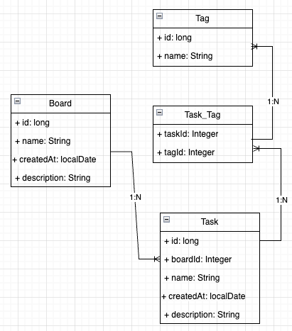

# Task Manager Server
This project is a Task Manager application built using Spring Boot. It allows users to create, manage, update, and delete tasks, organize them by assigning tags, and associate tasks with different boards. The application supports features like task status tracking (e.g., "To-Do", "In Progress", "Completed") and provides a REST API for easy integration with frontend applications or other services.



## Installation

To build and run the project, follow these steps:

Clone the repository:

```bash
git clone https://github.com/datnt700/task-manager-server.git
```

Build the project:

```bash
mvn clean install
```

Run the project:
```bash
mvn spring-boot:run
```

-> The application will be available at http://localhost:8080.